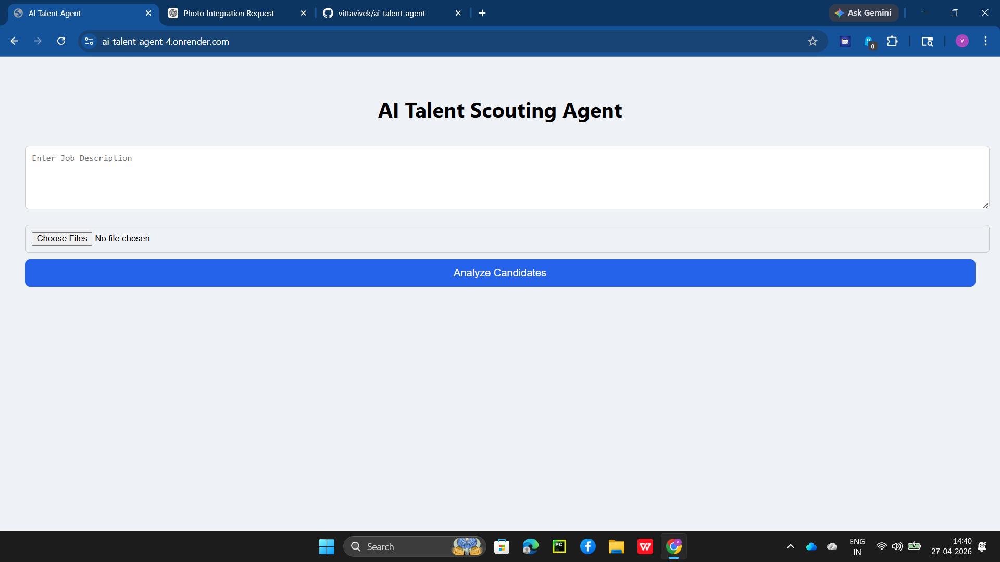
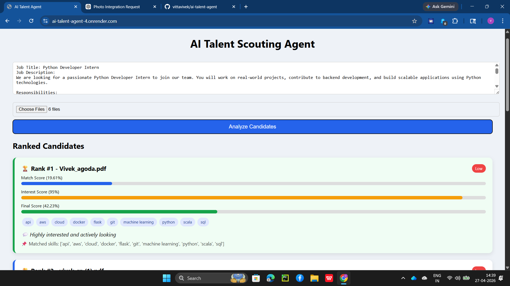
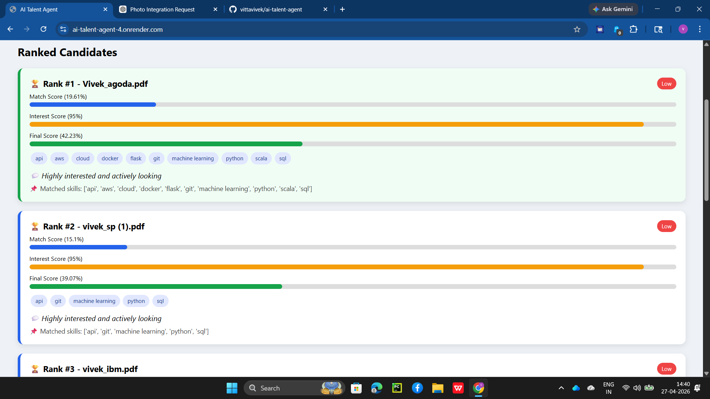
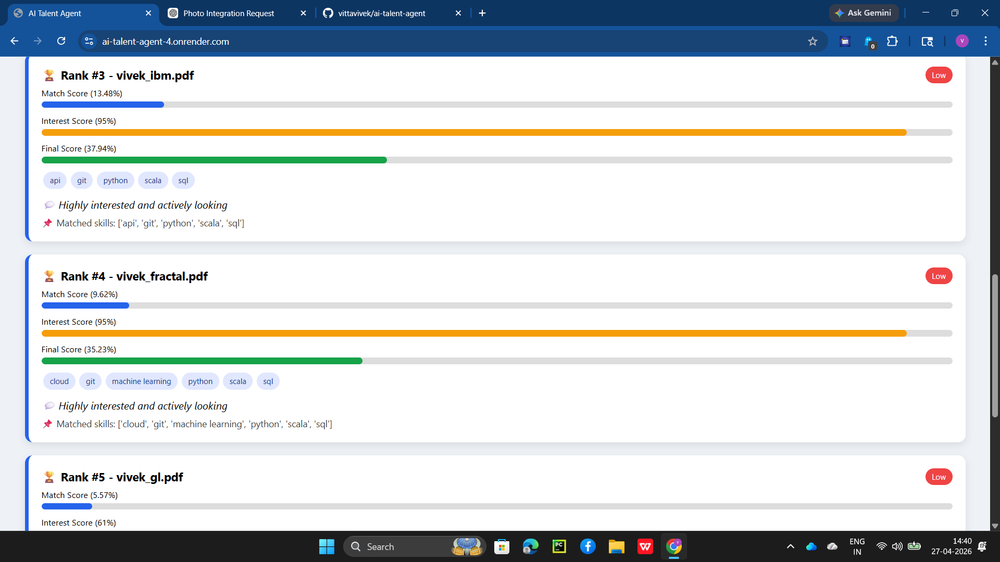
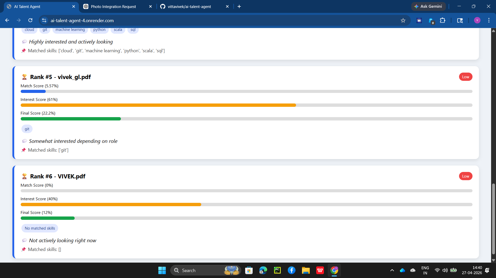

AI Talent Agent 🚀

## 🖥️ UI Preview

🌟 Experience it Live!  
🌐 Live Demo Application:https://ai-talent-agent-4.onrender.com/
📖 Interactive API Documentation: Explore the API (Swagger UI)

---

## 🔄 Workflow Demo

### 📥 Input & Upload

### ⚙️ Processing

---

## 📊 Results & Ranking

### 🥇 Top Candidate

### 📈 All Candidates

---

📌 Project Overview  
The AI Talent Agent is an intelligent web application designed to streamline the recruitment process. It analyzes a given Job Description (JD) and a batch of candidate resumes, automatically evaluating and ranking the candidates based on their semantic fit, skill overlap, and inferred interest in the role.

🔄 How It Works (End-to-End Workflow)  
The application follows a seamless pipeline to evaluate candidates:

Input Submission: The user inputs a Job Description and uploads one or multiple candidate resumes via the frontend interface.

Data Extraction & Parsing:

The backend uses parsing modules to intelligently extract core skills and requirements from the JD.  
It simultaneously processes the uploaded resumes, parsing out the candidates' skills and professional backgrounds.

Intelligent Semantic Matching:

The system compares the raw resume text against the job description using semantic similarity logic to compute a baseline Match Score.  
It also performs precise matching on technical skills to identify and highlight overlapping abilities.

Interest Scoring & Persona Simulation:

Using the interest_agent, the system simulates candidate behavior, generating an Interest Score and a customized response indicating why the candidate is a good fit and how interested they are in the position.

Final Evaluation & Ranking:

A weighted algorithm calculates the Final Score (e.g., 70% Match Score + 30% Interest Score).  
Candidates are automatically sorted from highest to lowest final score to highlight the best matches.

Interactive Presentation:

The frontend consumes the API response and displays the ranked candidates in a clean, visual card layout, showing progress bars for scores, matched skills tags, and AI-generated insights.

✨ Key Features  
Batch Processing: Upload and analyze multiple resumes at once.  
Semantic Analysis: Goes beyond simple keyword matching to understand context.  
Simulated Candidate Interest: Provides insights into a candidate's likelihood to engage.  
RESTful API: Built with FastAPI for high performance, concurrency, and easy integration.  
Responsive UI: Clean HTML/CSS/JS frontend for an intuitive user experience.

🛠️ Tech Stack  
Backend: Python, FastAPI, Uvicorn, asyncio  
Frontend: HTML5, Vanilla CSS, JavaScript  
AI/NLP: Custom scoring logic, semantic matchers, and simulated parsing models  
Hosting: Render  

📂 Project Structure  
ai-talent-agent/  
│  
├── backend/  
│   ├── main.py  
│   ├── parser.py  
│   ├── resume_reader.py  
│   ├── semantic_matcher.py  
│   ├── interest_agent.py  
│   └── requirements.txt  
│  
├── frontend/  
│   └── index.html  
│  
└── README.md  

⚙️ Setup & Installation (Local Development)  

1. Clone the Repository  
git clone https://github.com/vittavivek/ai-talent-agent.git  
cd ai-talent-agent  

2. Backend Setup  

cd backend  
python -m venv venv  

# Activate the virtual environment:  
# On Windows:  
venv\Scripts\activate  
# On macOS/Linux:  
# source venv/bin/activate  

# Install dependencies:  
pip install -r requirements.txt  

3. Run the Application  

uvicorn main:app --reload  

The server will start at http://127.0.0.1:8000. The frontend is automatically served at the root / endpoint. Open your browser and navigate to http://127.0.0.1:8000 to use the application locally.

📡 API Endpoints  
POST /process  
Input: Accepts jd (form data string) and resumes (list of files).  
Output: Returns a JSON object containing the ranked list of candidates with their match scores, interest scores, matched skills, and personalized responses.

👨‍💻 Author  
Vivek Vitta
